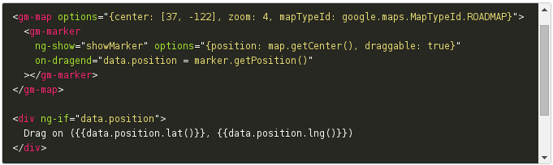

# angular-google-maps-native

[![NPM version][npm-image]][npm-url] [![Bower version][bower-image]][bower-url] [![Build Status][travis-image]][travis-url] [![Coverage Status][coverage-image]][coverage-url]

AngularJS directives for the Google Maps Javascript API using the native way.

[Project page](http://jbdemonte.github.io/angular-google-maps-native/)

## Example

[npm-url]: https://npmjs.org/package/angular-google-maps-native
[npm-image]: https://badge.fury.io/js/angular-google-maps-native.svg

[bower-url]: http://badge.fury.io/bo/angular-google-maps-native
[bower-image]: https://badge.fury.io/bo/angular-google-maps-native.svg

[travis-url]: http://travis-ci.org/jbdemonte/angular-google-maps-native
[travis-image]: https://secure.travis-ci.org/jbdemonte/angular-google-maps-native.png?branch=master

[coverage-url]: https://coveralls.io/github/jbdemonte/angular-google-maps-native?branch=master
[coverage-image]: https://coveralls.io/repos/jbdemonte/angular-google-maps-native/badge.svg?branch=master&service=github
